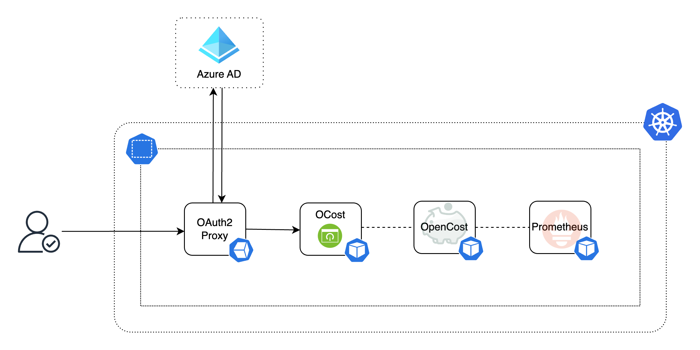

# Documentation

## Deployment Architecture
Kubernetes resources and link to Azure Active Directory (AAD) are outlined below.
[OAuth2 Proxy](https://oauth2-proxy.github.io/oauth2-proxy/) forwards authenticated
users up to a [Gin](https://github.com/gin-gonic/gin) app running in the same
namespaces as [OpenCost](https://github.com/opencost/opencost) and [Prometheus](https://prometheus.io/). OCost queries the OpenCost API and returns a templated HTML response
based on the AAD security groups the user is a member of.

  

